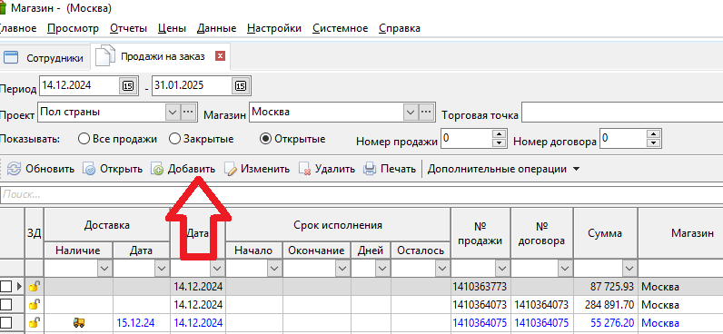
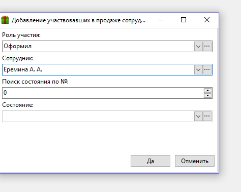
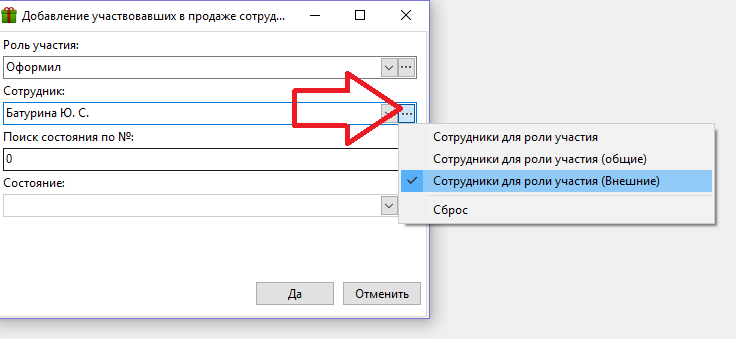
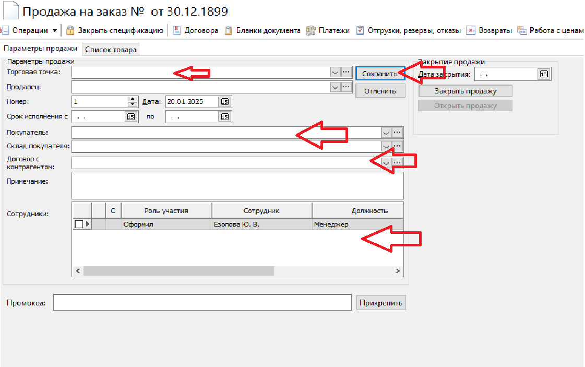

Для создания новой продажи на заказ, необходимо зайти в программу SHOP. Выбираем нужную базу города, вводим пароль.

В программе SHOP выбираем вкладку «Главное» - «Продажа товара на заказ».

В открывшемся окне правой кнопкой мыши вызываем меню и выбираем «Добавить»

{width=796px height=368px}

\
Открывается окно продажи, которое называется «Ведомость продажи на заказ». В вкладке «Параметры продажи» заполняем поля:

-  «Торговая точка» - выбираем из выпадающего списка магазин(склад) на который оформляется ПНЗ

-  «Покупатель» - например: ИП Родак Анна Вячеславовна

-  «Сотрудники»- Для добавления сотрудника, нажимаем правую кнопку мыши и выбираем «добавить сотрудника». Если продажа оформляется в базе города, где вы оформлены, то просто добавляем себя с ролью «оформил». Если вы добавляете ПНЗ в базе другого города, то себя необходимо выбрать ролью «оформил», но обязательно через список «сотрудники внешние», после этого необходимо добавить сотрудников на кого оформляется продажа. Правой кнопкой мыши вызываем меню в поле. Появляется окно, где мы выбираем «добавить сотрудника» - роль участия: участвовал в продаже, сотрудник: менеджер по оптовому товару ТОРГОВЫЙ). Закрываем окно, вверху нажимаем «Сохранить».

   В Базе своего города:

   {width=474px height=379px}

    В Базе другого города:

-   

   {width=736px height=339px}

   

   

Окно продажи:

{width=1121px height=703px}